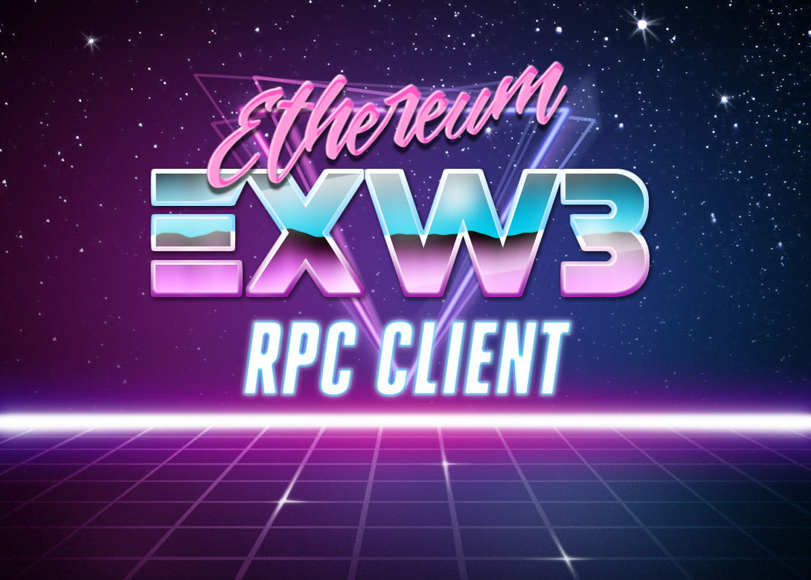

# ExW3

[](https://github.com/hswick/exw3/actions?query=workflow%3Atest)
[](https://hex.pm/packages/exw3)

This project is no longer under active development. PRs are welcome and are usually merged in a timely manner.

My life took me in a different direction and I am currently not involved with Ethereum ecosystem and such this
library isn't useful for me. Although, this has seemed to be useful for others and I am glad to see that.

If you might be willing to take this project over, please feel free to reach out to me.

<p align="center">
  
</p>

## Installation

```elixir
def deps do
  [{:exw3, "~> 0.4.4"}]
end
```
## Overview

ExW3 is a wrapper around ethereumex to provide a high level, user friendly json rpc api. This library is focused on providing a handy abstraction for working with smart contracts, and any other relevant utilities.

## Usage

Ensure you have an ethereum node to connect to at the specified url in your config. An easy local testnet to use is ganache-cli:
```
ganache-cli
```

Or you can use parity:
Install Parity, then run it with

```
echo > passfile
parity --chain dev --unlock=0x00a329c0648769a73afac7f9381e08fb43dbea72 --reseal-min-period 0 --password passfile
```

If Parity complains about password or missing account, try

```
parity --chain dev --unlock=0x00a329c0648769a73afac7f9381e08fb43dbea72
```

### Http

To use Ethereumex's HttpClient simply set your config like this:
```elixir
config :ethereumex,
  client_type: :http,
  url: "http://localhost:8545"
```

### Ipc

If you want to use IpcClient set your config to something like this:
```elixir
config :ethereumex,
  client_type: :ipc,
  ipc_path: "/.local/share/io.parity.ethereum/jsonrpc.ipc"
```

Provide an absolute path to the ipc socket provided by whatever Ethereum client you are running. You don't need to include the home directory, as that will be prepended to the path provided.

* NOTE : Use of Ipc is recommended, as it is more secure and significantly faster.

Currently, ExW3 supports a handful of json rpc commands. Primarily the ones that get used the most. If ExW3 doesn't provide a specific command, you can always use the [Ethereumex](https://github.com/exthereum/ethereumex) commands.

Check out the [documentation](https://hexdocs.pm/exw3/ExW3.html) for more details of the API.

### Example

```elixir
iex(1)> accounts = ExW3.accounts()
["0x00a329c0648769a73afac7f9381e08fb43dbea72"]
iex(2)> ExW3.balance(Enum.at(accounts, 0))
1606938044258990275541962092341162602522200978938292835291376
iex(3)> ExW3.block_number()
1252
iex(4)> simple_storage_abi = ExW3.load_abi("test/examples/build/SimpleStorage.abi")
%{
  "get" => %{
    "constant" => true,
    "inputs" => [],
    "name" => "get",
    "outputs" => [%{"name" => "", "type" => "uint256"}],
    "payable" => false,
    "stateMutability" => "view",
    "type" => "function"
  },
  "set" => %{
    "constant" => false,
    "inputs" => [%{"name" => "_data", "type" => "uint256"}],
    "name" => "set",
    "outputs" => [],
    "payable" => false,
    "stateMutability" => "nonpayable",
    "type" => "function"
  }
}
iex(5)> ExW3.Contract.start_link
{:ok, #PID<0.265.0>}
iex(6)> ExW3.Contract.register(:SimpleStorage, abi: simple_storage_abi)
:ok
iex(7)> {:ok, address, tx_hash} = ExW3.Contract.deploy(:SimpleStorage, bin: ExW3.load_bin("test/examples/build/SimpleStorage.bin"), options: %{gas: 300_000, from: Enum.at(accounts, 0)})
{:ok, "0x22018c2bb98387a39e864cf784e76cb8971889a5",
 "0x4ea539048c01194476004ef69f407a10628bed64e88ee8f8b17b4d030d0e7cb7"}
iex(8)> ExW3.Contract.at(:SimpleStorage, address)
:ok
iex(9)> ExW3.Contract.call(:SimpleStorage, :get)
{:ok, 0}
iex(10)> ExW3.Contract.send(:SimpleStorage, :set, [1], %{from: Enum.at(accounts, 0), gas: 50_000})
{:ok, "0x88838e84a401a1d6162290a1a765507c4a83f5e050658a83992a912f42149ca5"}
iex(11)> ExW3.Contract.call(:SimpleStorage, :get)
{:ok, 1}
```

## Address Type

If you are familiar with web3.js you may find the way ExW3 handles addresses unintuitive. ExW3's abi encoder interprets the address type as an uint160. If you are using an address as an option to a transaction like `:from` or `:to` this will work as expected. However, if one of your smart contracts is expecting an address type for an input parameter then you will need to do this:
```elixir
a = ExW3.to_decimal("0x88838e84a401a1d6162290a1a765507c4a83f5e050658a83992a912f42149ca5")
```

## Events

ExW3 allows the retrieval of event logs using filters or transaction receipts. In this example we will demonstrate a filter. Assume we have already deployed and registered a contract called EventTester.

```elixir
# We can optionally specify extra parameters like `:fromBlock`, and `:toBlock`
{:ok, filter_id} = ExW3.Contract.filter(:EventTester, "Simple", %{fromBlock: 42, toBlock: "latest"})

# After some point that we think there are some new changes
{:ok, changes} = ExW3.Contract.get_filter_changes(filter_id)

# We can then uninstall the filter after we are done using it
ExW3.Contract.uninstall_filter(filter_id)
```

## Indexed Events

Ethereum allows a user to add topics to filters. This means the filter will only return events with the specific index parameters. For all of the extra options see [here](https://github.com/ethereum/wiki/wiki/JSON-RPC#eth_newfilter)

If you have written your event in Solidity like this:
```
event SimpleIndex(uint256 indexed num, bytes32 indexed data, uint256 otherNum);
```

You can add a filter on which logs will be returned back to the RPC client based on the indexed fields.

ExW3 allows for 2 ways of specifying these parameters (`:topics`) in two ways. The first, and probably more preferred way, is with a map:

```elixir
indexed_filter_id = ExW3.Contract.filter(
  :EventTester,
  "SimpleIndex",
  %{
    topics: %{num: 46, data: "Hello, World!"},
  }
)
```

The other option is a list (mapped version is an abstraction over this). The downside here is this is order dependent. Any values you don't want to specify must be represented with a `nil`. This approach has been included because it is the implementation of the JSON RPC spec.

```elixir
indexed_filter_id = ExW3.Contract.filter(
  :EventTester,
  "SimpleIndex",
  %{
    topics: [nil, "Hello, World!"]
  }
)
```

Here we are skipping the `num` topic, and only filtering on the `data` parameter.

NOTE!!! These two approaches are mutually exclusive, and for almost all cases you should prefer the map.

## Continuous Event Handling

In many cases, you will want some process to continuously listen for events. We can implement this functionality using a recursive function. Since Elixir uses tail call optimization, we won't have to worry about blowing up the stack.

```elixir
def listen_for_event do
  {:ok, changes} = ExW3.Contract.get_filter_changes(filter_id) # Get our changes from the blockchain
  handle_changes(changes) # Some function to deal with the data. Good place to use pattern matching.
  :timer.sleep(1000) # Some delay in milliseconds. Recommended to save bandwidth, and not spam.
  listen_for_event() # Recurse
end
```

# Compiling Solidity

To compile the test solidity contracts after making a change run this command:
```
solc --abi --bin --overwrite -o test/examples/build test/examples/contracts/*.sol
```

# Contributing

## Test

The full test suite requires a running blockchain. You can run your own or start `openethereum` with `docker-compose`.

```bash
$ docker-compose up
$ mix test
```
